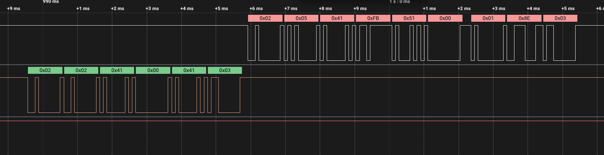

# Rollotron 1300 Reverse Engineering

> [!WARNING]  
> This project is a work in progress. 
> Core functionalities are operational, and additional content, including images and code examples, will be added soon.

## Project
This project aims to reverse engineer the Rollotron 1300, a roller shutter control system manufactured by Rademacher. 
The primary goal is to make it compatible with smart home systems using ESP32, ESP8266, and similar platforms.

The motivation behind this project is to add smart home functionality to existing Rollotron 1300 units that do not originally support such features.

## Communication
The Rollotron 1300 operates similar to a client-server architecture. 
- **Frontend (Control Panel):** The control panel serves as the frontend, responsible for user interaction. It communicates with the motor's microcontroller using a serial connection.

- **Backend (Motor):** The motor's microcontroller functions as the backend, executing commands received from the control panel.

### Status Request

## Wiring
Connect the White TX Cable to Pin 12 on the ESP866 module, and the Blue RX Cable to Pin 14. 
Pins 12 and 14 are used for software serial communication. 
**Take a look at the attached Arduino sketch!**

The image below is the back of the control panel pcb.

